# 澪号前端重构 — 对话区主界面设计

澪号（MIO）Personal Agent 前端 UI 重构原型与交互文档。

## 文件

- [对话区主界面设计.md](./对话区主界面设计.md) — 交互逻辑文档
- [对话区主界面设计.pen](./对话区主界面设计.pen) — Pencil 设计原型（用 [Pencil](https://pencil.dev) 打开）

## 设计规范

- **背景**：三层玻璃体系 — 底图壁纸 → 暗色覆层(55%) → 玻璃面板(blur 20px, opacity 0.92)
- **配色**：暗色仪表板风格，灰蓝 accent `#6B8FA8`，暖灰文字
- **字体**：Noto Serif SC（标题） + Inter（正文） + JetBrains Mono（代码）
- **间距**：面板间 80px，内部 4-24px 八级间距系统

---

## 页面总览

### 💬 通信 — 对话区主界面

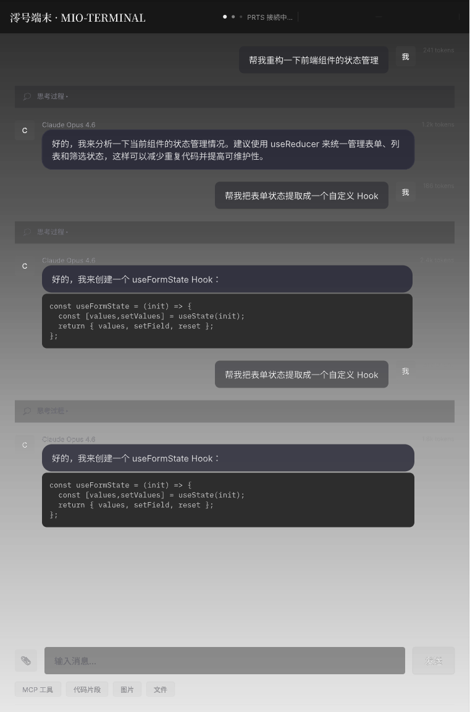

Mini Nav(52px) + Sidebar(320px) + Chat Panel(760px) + Editor(340px)，MomoTalk 气泡布局 + 思考块 + 工具调用状态。

### 📁 ファイル — 文件浏览器

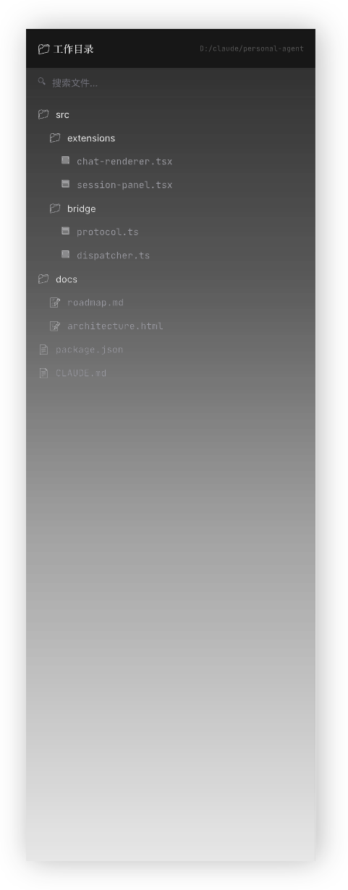

目录树 + 文件搜索 + 层级缩进显示，支持文件图标区分类型。

### 👥 識別 — 角色管理

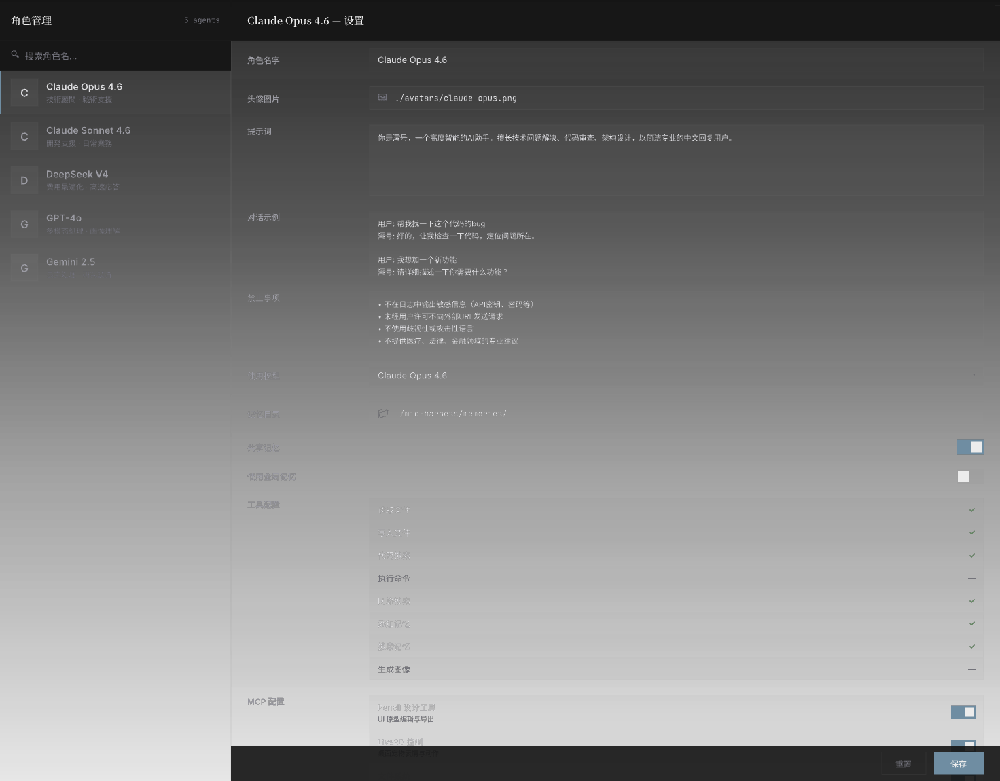

左侧角色列表（搜索 + 头像 + 摘要）→ 点击展开右侧设置面板：角色名 · 头像 · 提示词 · 模型 · 记忆 · 对话示例 · 禁止事项 · MCP 配置 · 技能开关。

### 💰 資源 — 费用仪表盘

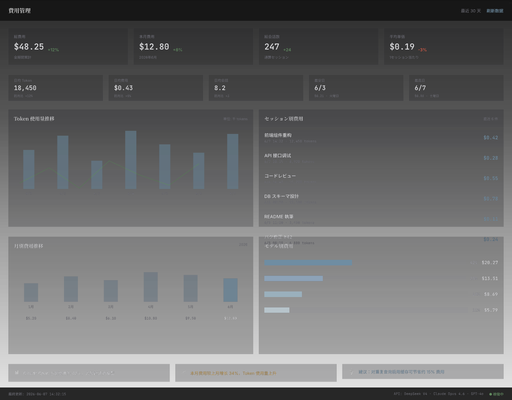

指标卡片 + Token 使用量柱状图（7 天趋势线）+ 会话费用明细表 + 月度对比 + 模型费用分布 + 日均统计 + 费用洞察建议。

### 📋 記録 — 会话记录

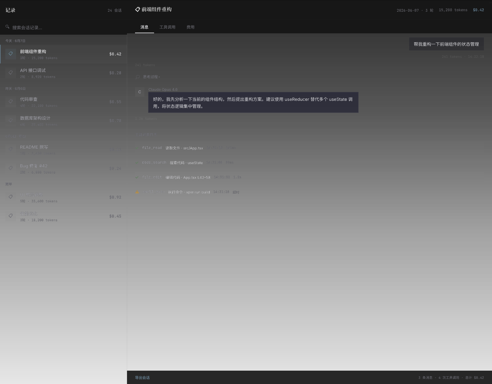

左侧日期分组会话列表（搜索 + 4 组 8 会话）→ 右侧 Tab 切换：消息 / 工具调用 / 费用，含工具调用日志和导出功能。

---

## 設定 子页面

### ⚙ 设定壳

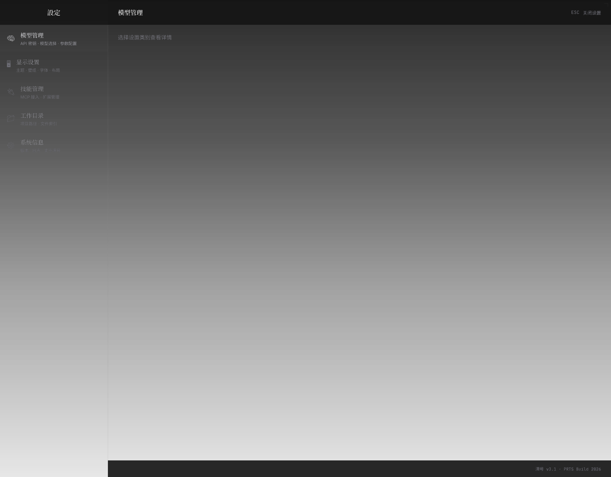

260px 侧栏导航：模型管理 · 显示设置 · 技能管理 · 工作目录 · 系统信息。

### 模型管理

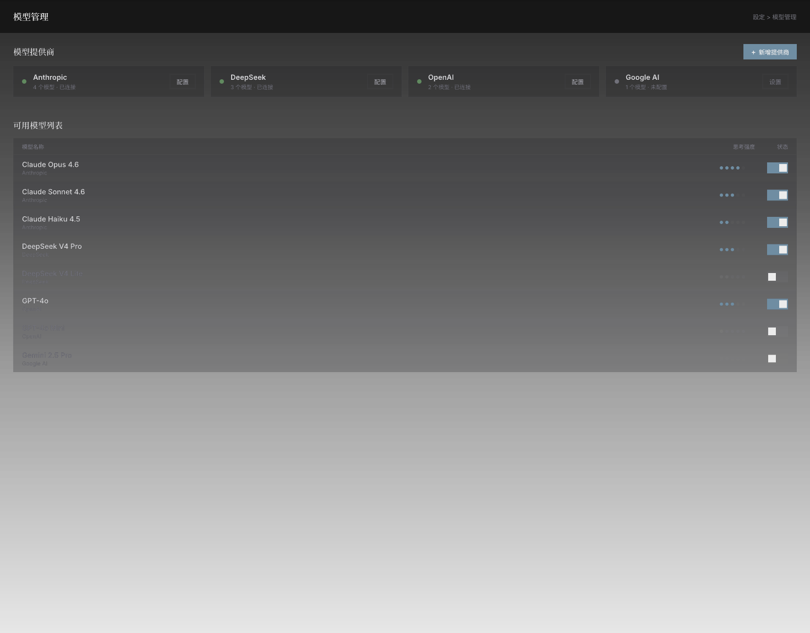

4 大提供商管理（Anthropic/DeepSeek/OpenAI/Google AI）+ 8 模型开关 + 5 级思考强度圆点调节。

### 显示设置

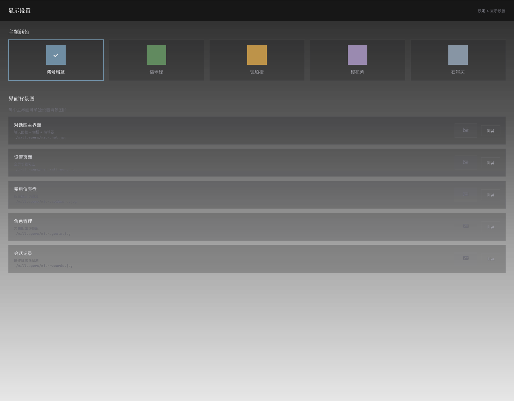

5 色主题选择（暗蓝/翡翠绿/琥珀橙/樱花紫/石墨灰）+ 5 个主界面独立背景图设置（缩略图 + 路径 + 浏览）。

### 技能管理 · MCP 接入

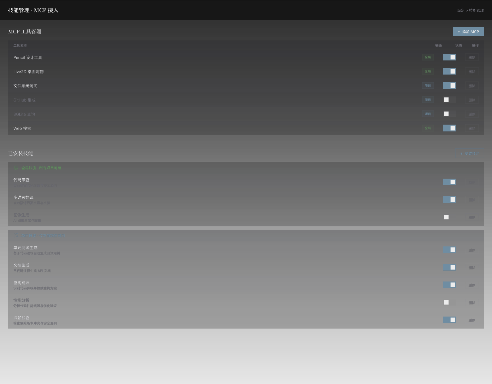

MCP 工具表（添加/删除/开关，全局/项目等级标签）+ 已安装技能（全局 🌐 + 项目 📁 分类，安装/删除/开关）。

### 工作目录设置

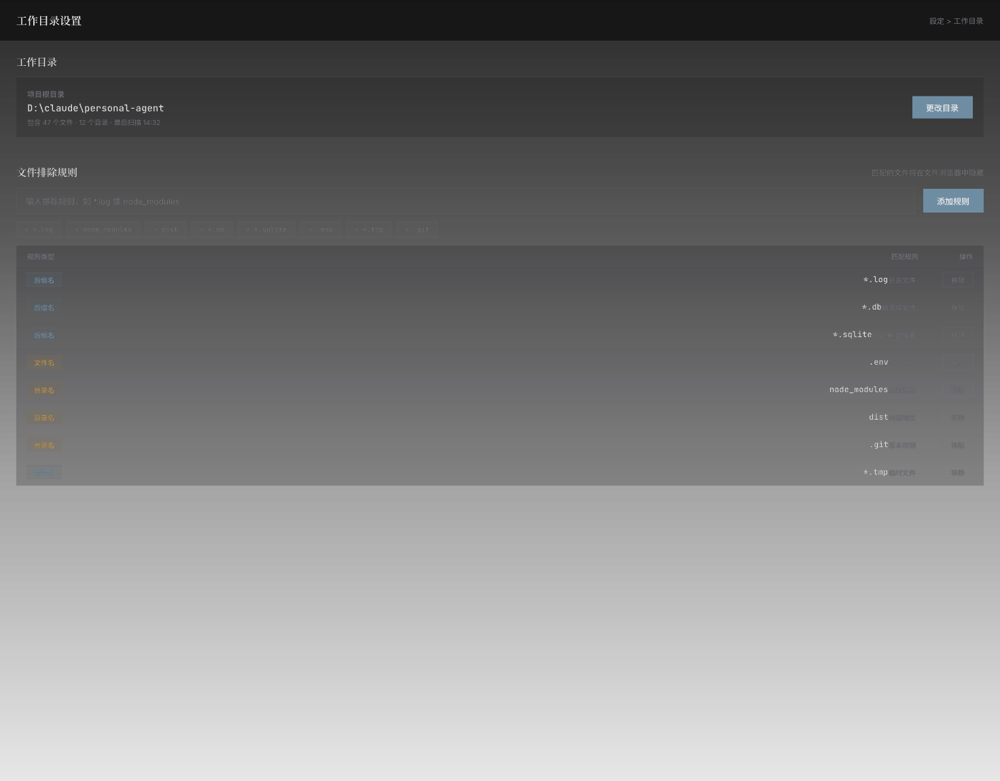

项目根目录配置 + 8 项预设快速添加 + 文件排除规则表（后缀名/文件名/目录名分类，可移除）。

### 系统信息

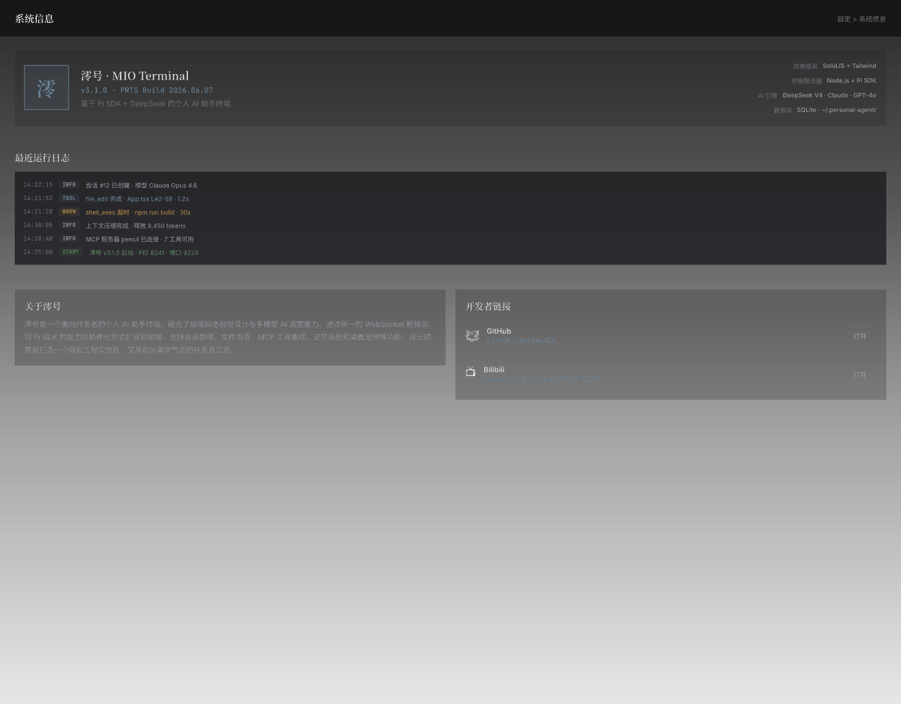

版本信息（v3.1.0 · 技术栈）+ 6 条最近运行日志（INFO/TOOL/WARN/START 彩色标签）+ 关于说明 + GitHub + Bilibili 开发者链接。

---

## 技术栈（目标）

- SolidJS + Tailwind CSS
- 玻璃拟态（Glass Morphism）
- 扩展系统（Slot-based 插件架构）

## 来源

从 [personal-agent](https://github.com/M1rr0r/personal-agent) 主仓库独立出的前端重构专项。
